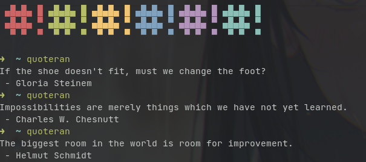
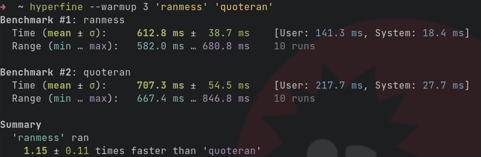

# quoteran

Get random quotes in terminal.

This project fetch the [Quotable.io API](https://api.quotable.io/random).



## Install

You can install [Quoteran](https://pypi.org/project/quteran) from PyPI:

```bash
pip install quoteran
```

To get the last version:

```bash
pip install git+https:/github.com/UltiRequiem/quoteran
```

If you use Linux, you may need to install this with sudo to
be able to access the command throughout your system.

## Usage

```bash
quoteran
```

### License

This project is Licensed under the [MIT](./LICENSE) License.

### Alternative

I also developed this in Nodejs: [UltiRequiem/ranmess](https://github.com/UltiRequiem/ranmess)



The version written in Nodejs is significantly faster,
and it was even easier to develop and publish than this.
